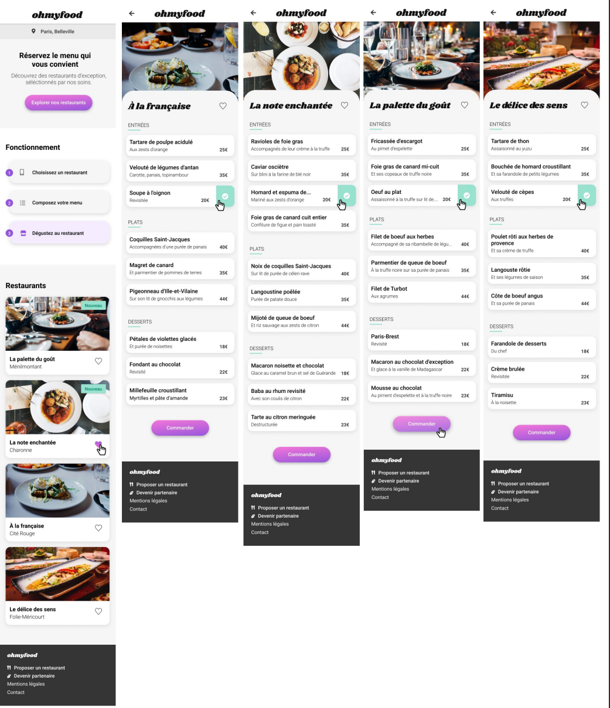

<h1>Ohmyfood!</h1>

Voir le projet en live >>> [Ohmyfood!](https://amandinesis.github.io/AmandineSismondi_3_10062021/)

Ohmyfood! est une jeune startup qui voudrait s'imposer sur le marché de la restauration. 
L'objectif est de développer un site 100% mobile qui répertorie les menus de restaurants gastronomiques. 
En plus des systèmes classiques de réservation, les clients pourront composer le menu de leur repas pour que les plats soient prêts à leur arrivée. 
Finis, les temps d'attente au restaurant !

<h3>Cible</h3>

Classes moyennes et supérieures, connectées et souvent pressées, souhaitant déguster des produits de qualité.

<h3>Identité graphique</h3>

<h4>Polices</h4> 
<li>Logo et titres: Shrikhand</li>
<li>Texte: Roboto</li>

<h4>Couleurs</h4> 
<li>Primaire: #9356DC</li>
<li>Secondaire: #FF79DA</li>
<li>Tertiaire: #99E2D0</li>

<h3>Compatibilité</h3>

La cible étant les personnes connectées et pressées, le site sera développé en utilisantl’approche mobile-first. 
Pour cette raison, seules des maquettes mobiles seront réalisées.
Sur tablette et desktop, le site devra s’adapter, mais ces supports n’étant pas prioritaires,leur mise en page est libre.

<li>L’ensemble du site devra être responsive sur mobile, tablette et desktop.</li>
<li>Les pages devront passer la validation W3C en HTML et CSS sans erreur.</li>
<li>Le site doit être parfaitement compatible avec les dernières versions desktop deChrome et Firefox</li>
